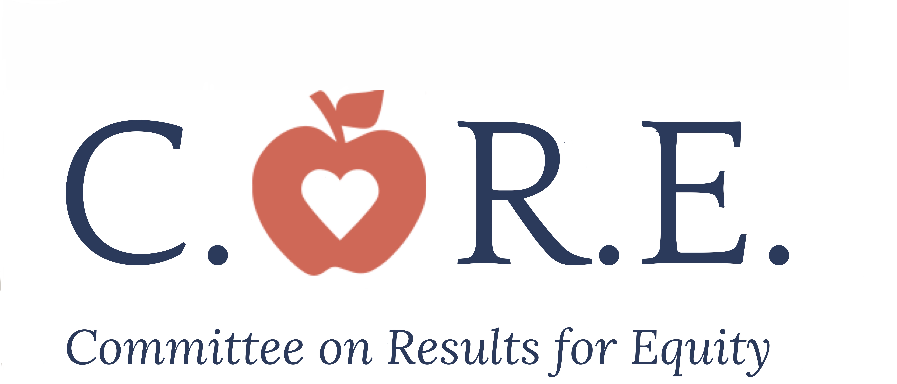
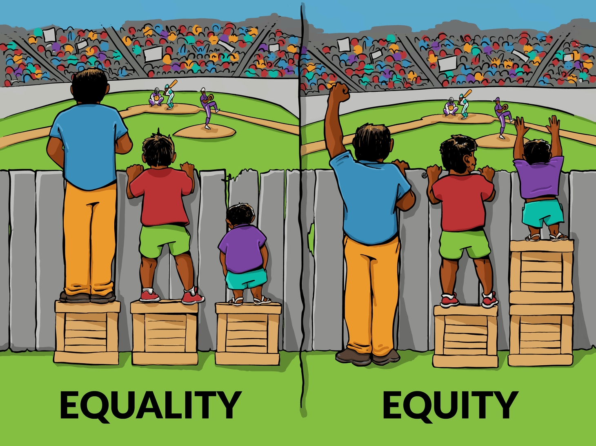

```{r, packages, include= TRUE, echo = FALSE, message = FALSE, error = FALSE, warning=FALSE}
library("showtext")
library("sysfonts")
library("tidyverse")
library("lubridate")
library("showtext")


font_add_google(name = "Nobile")

source("discretion_word_cloud.R")
```
class: title-slide

.center[]
## Discretion Mapping: Agenda

.bottom[.right[`r today() %>% format("%A, %B %d %Y")`]]

--

* What is Core

--

* Origins and Results of Discretion Mapping

--

* Results from the Project

--

* Next Steps
  + Personal recommendation


---
# What Is Core

* Committee for Results on Equity

--

* From our efforts on Disproportionate Minority Contact

--

* Advises MOAT to ensure policy and program equity regardles of identity, including:

  + Racial
  + Ethnic
  + Gender
  + Sexual
  + Religious
  + Ability
  
---
# Equality vs Equity

.center[]

---
# The Mapping Project

* Definition of Discretion: 
  + Discretion refers to the choices made by the officer when implementing
    - policy
    - practice
    - or referring to a program. 

* Scope

 + Limited to Probation and Court Services
 
 + Mapping areas of discretion
  - Not measuring the impact of discretion
---

# Discretion Mapping Team
* Composed of:
  + Two DCPOs
  + Four SPOs
  + Three field officers
  
* Started in February, 2017

* Completed phase one Feburary 22, 2018
  + [When the executive summary was completed](https://www.dropbox.com/s/i9uelv05gz0u18e/Discretion_Mapping_Summary.pdf?dl=0)
---

# Method:
## Three distinction sections

* **Pe-trial**
  + Detention Screening
  + Expeditor

* **Trial/Hearing**
  + Adjudication
  + Field
  
* **Services**
  + Field
  + Clinical
---

# Method: 
## Through the System

* Young man of color traveling through probation

* Data sources
  + Policies
  + Forms
  + Program Documentaion
  + Interviews with DCPOs, SPOs, POs
  
---
class: middle

# Visualizing Our Notes
```{r, wordcloud, include = TRUE, message=FALSE, echo =FALSE, error = FALSE, fig.align='center', fig.cap = "Visiualization of the 9 pages discretion mapping notes."}

  wordcloud(discretion_words$word, discretion_words$n, min.freq = 5, random.order = FALSE,
            random.color = FALSE, 
            color = pro_colors_scheme2,
            scale = c(4, 2 ))
```


---
# Results

* Approximately 45 discretion points through the system
  + Estimate stems from the ways discretion points can be measured
  
* Discretion points exist from detention screening to case termination

* Including *Objective Measures*
---
# Next Steps

* Determine an aspect to focus on
  + Pre-trial
  + Trial/Hearing
  + Services
  
* Clean Data
  + Audit of sources and storage
  + Follow best practices regarding 
     - Open Data
     - Data Science
---
.center[#Commit to a Year Long Project] 
.center[]

