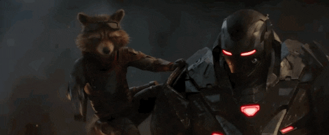

 
 

*The following is for testing purposes. It is testing: *

* netlify
* custom css
* table of contents
* rstudio

*I know it's a hot mess.*

# Iron Man 
test

## Begining the transformation from solo to team player.
  1 and 2 he is solo or duo
  mostly solo
  
## Iron 1, iron 2
  tony start built this in a cave 
  Rhodey

  Rhodey is in the suit, rocket is the racoon.
  
## iron 3 = tony stark movie

## avengers
## one is good
## two is not
## he is wrong in civil war

# Logo
text text
